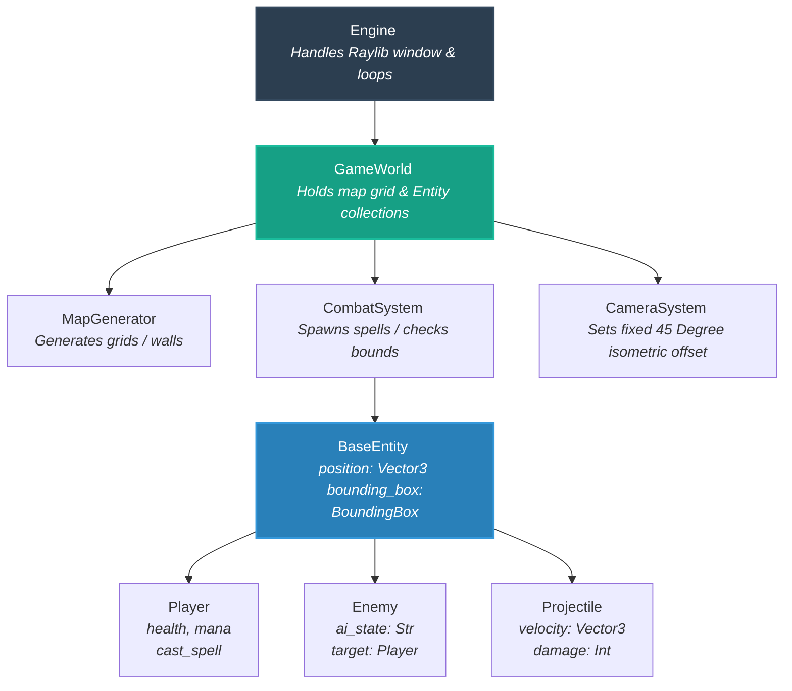

# Game-Dev_Prototype
Pygame prototype for Godot project. 

___

## 📂 Project Structure

```text
wizard_prototype/
│
├── assets/                  # 3D Models, Textures, Sound Effects
│   ├── models/
│   └── audio/
│
├── src/                     # All source code
│   ├── __init__.py
│   ├── main.py              # Entry point (initializes engine & loops)
│   │
│   ├── core/                # Core engine wrappers & orchestrators
│   │   ├── __init__.py
│   │   ├── engine.py        # Raylib window initialization, main game loop
│   │   └── camera.py        # Isometric camera tracking logic
│   │
│   ├── systems/             # Pure game mechanics (Engine-agnostic logic)
│   │   ├── __init__.py
│   │   ├── combat.py        # Spell casting, damage resolution, hitboxes
│   │   └── map_gen.py       # Procedural dungeon/grid layout generation
│   │
│   └── entities/            # Game Objects (Data + localized state)
│       ├── __init__.py
│       ├── base_entity.py   # Parent class for anything with a 3D position
│       ├── player.py        # Player stats, inputs, and spell state
│       ├── enemy.py         # Enemy AI state machines
│       └── projectile.py    # Spell/Fireball movement arrays
│
├── requirements.txt         # For managing `pyray` dependency
└── README.md
```

___

## 🏗️ Object Architecture Blueprint


___


# Phase 1: The Core Foundation (Getting a Window and a Grid)
Your first goal is simply to initialize the engine, create a 3D canvas, and render a basic floor grid to prove the 3D camera works.

### 1. requirements.txt
Task: Add raylib (or pyray depending on your preference, though raylib is the modern wrapper package name).

Action: Run pip install raylib.

### 2. src/core/camera.py
Task: Create your basic IsometricCamera wrapper class.

Action: Define a standard Raylib Camera3D object inside. Hardcode its initial position at an offset (e.g., x=10, y=10, z=10) looking down at (0, 0, 0) so you get that instant isometric viewing angle.

### 3. src/core/engine.py & src/main.py
Task: Initialize the Raylib window and hook up the main loop.

Action: Inside engine.py, open a window using rl.init_window(). Inside the loop, clear the background, begin 3D mode with your camera, draw a basic grid using rl.draw_grid(), and close out. Execute this from main.py to ensure your setup runs smoothly.

# Phase 2: Spatial Entities & Isometric Movement
Now that you have a 3D grid space, it's time to put a player on it and move them around using classic controls.

### 4. src/entities/base_entity.py
Task: Define what it means to exist in your world.

Action: Create the BaseEntity class. Give it a position (a 3D vector) and a generic draw() method.

### 5. src/entities/player.py
Task: Create the player entity and handle keyboard inputs.

Action: Inherit from BaseEntity. Override the update() method to check for key presses (rl.is_key_down()). If 'W' is pressed, adjust the position. In the draw() method, represent the player as a simple cube using rl.draw_cube().

### 6. Update src/core/camera.py (Camera Tracking)
Task: Link the camera position to the player.

Action: Update the camera's target to point exactly at the player's 3D position vector, maintaining the relative isometric offset as the player moves.

# Phase 3: World Building & Basic Obstacles
With movement verified, you need boundaries and structured environments to move through.

### 7. src/systems/map_gen.py
Task: Generate a static or semi-procedural array grid representing the layout.

Action: Create a simple 2D integer array (0 for floor, 1 for wall).

### 8. Update src/core/engine.py (World Rendering)
Task: Render the level layout in 3D.

Action: Have your game loop iterate through the map grid array. Wherever there is a 1, use rl.draw_cube() at those coordinates to raise a 3D wall box block.

# Phase 4: Roguelike Mechanics (Spells & Enemies)
Now that you can navigate an environment, layer on your dynamic wizard combat and AI elements.

### 9. src/entities/projectile.py & src/systems/combat.py
Task: Implement spell casting functionality.

Action: Create a Projectile entity that travels forward along a directional vector. In combat.py, handle spawning these projectiles when the player clicks, and run basic bounding-box intersection checks against walls.

### 10. src/entities/enemy.py
Task: Add basic targets.

Action: Create an Enemy class that inherits from BaseEntity. Give it a simple state machine (e.g., if distance to player < 15, move directly toward player position).
