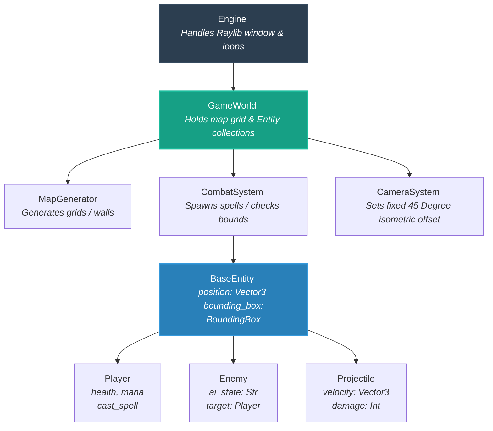

# Game-Dev_Prototype
Pygame prototype for Godot project. 

___

## 📂 Project Structure

```text
wizard_prototype/
│
├── assets/                  # 3D Models, Textures, Sound Effects
│   ├── models/
│   └── audio/
│
├── src/                     # All source code
│   ├── __init__.py
│   ├── main.py              # Entry point (initializes engine & loops)
│   │
│   ├── core/                # Core engine wrappers & orchestrators
│   │   ├── __init__.py
│   │   ├── engine.py        # Raylib window initialization, main game loop
│   │   └── camera.py        # Isometric camera tracking logic
│   │
│   ├── systems/             # Pure game mechanics (Engine-agnostic logic)
│   │   ├── __init__.py
│   │   ├── combat.py        # Spell casting, damage resolution, hitboxes
│   │   └── map_gen.py       # Procedural dungeon/grid layout generation
│   │
│   └── entities/            # Game Objects (Data + localized state)
│       ├── __init__.py
│       ├── base_entity.py   # Parent class for anything with a 3D position
│       ├── player.py        # Player stats, inputs, and spell state
│       ├── enemy.py         # Enemy AI state machines
│       └── projectile.py    # Spell/Fireball movement arrays
│
├── requirements.txt         # For managing `pyray` dependency
└── README.md
```

___

## 🏗️ Object Architecture Blueprint

