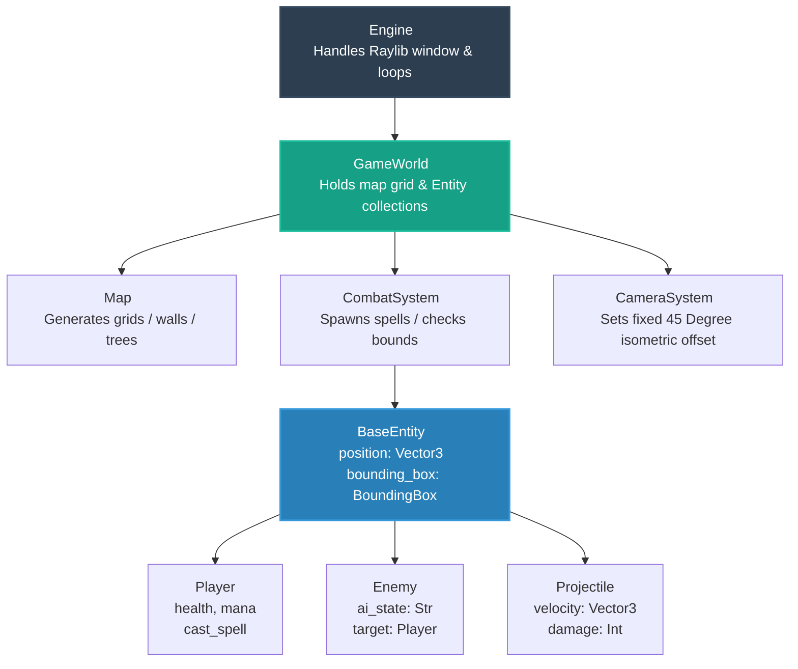
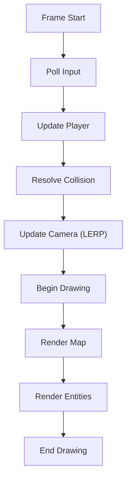

# Game-Dev_Prototype
Pygame prototype for Godot project. 

___

## 📂 Project Structure

```text
wizard_prototype/
│
├── assets/                  # 3D Models, Textures, Sound Effects
│   ├── models/
│   └── audio/
│
├── src/                     # All source code
│   ├── __init__.py
│   ├── main.py              # Entry point (initializes engine & loops)
│   │
│   ├── core/                # Core engine wrappers & orchestrators
│   │   ├── __init__.py
│   │   ├── engine.py        # Raylib window initialization, main game loop
│   │   └── camera.py        # Isometric camera tracking logic
│   │
│   ├── systems/             # Pure game mechanics (Engine-agnostic logic)
│   │   ├── __init__.py
│   │   └── combat.py        # Spell casting, damage resolution, hitboxes
│   │          
│   │
│   ├── entities/            # Game Objects (Data + localized state)
│   │    ├── __init__.py
│   │    ├── base_entity.py   # Parent class for anything with a 3D position
│   │    ├── player.py        # Player stats, inputs, and spell state
│   │    ├── enemy.py         # Enemy AI state machines
│   │    └── projectile.py    # Spell/Fireball movement arrays
│   │
│   └── world/
│        ├── __init__.py
│        └── map.py           # Procedural level layout generation
│        
├── requirements.txt          # For managing `pyray` dependency
└── README.md
```

___

## 🏗️ Object Architecture Blueprint


___

## <u>Current Phase: End of Phase 3</u>

# Phase 1: The Core Foundation (Getting a Window and a Grid)
Your first goal is simply to initialize the engine, create a 3D canvas, and render a basic floor grid to prove the 3D camera works.

### 1. requirements.txt
Task: Add raylib (or pyray depending on your preference, though raylib is the modern wrapper package name).

Action: Run pip install raylib.

### 2. src/core/camera.py
Task: Create your basic IsometricCamera wrapper class.

Action: Define a standard Raylib Camera3D object inside. Hardcode its initial position at an offset (e.g., x=10, y=10, z=10) looking down at (0, 0, 0) so you get that instant isometric viewing angle.

### 3. src/core/engine.py & src/main.py
Task: Initialize the Raylib window and hook up the main loop.

Action: Inside engine.py, open a window using rl.init_window(). Inside the loop, clear the background, begin 3D mode with your camera, draw a basic grid using rl.draw_grid(), and close out. Execute this from main.py to ensure your setup runs smoothly.

# Phase 2: Spatial Entities & Isometric Movement
Now that you have a 3D grid space, it's time to put a player on it and move them around using classic controls.

### 4. src/entities/base_entity.py
Task: Define what it means to exist in your world.

Action: Create the BaseEntity class. Give it a position (a 3D vector) and a generic draw() method.

### 5. src/entities/player.py
Task: Create the player entity and handle keyboard inputs.

Action: Inherit from BaseEntity. Override the update() method to check for key presses (rl.is_key_down()). If 'W' is pressed, adjust the position. In the draw() method, represent the player as a simple cube using rl.draw_cube().

### 6. Update src/core/camera.py (Camera Tracking)
Task: Link the camera position to the player.

Action: Update the camera's target to point exactly at the player's 3D position vector, maintaining the relative isometric offset as the player moves.

# Phase 3: World Building & Basic Obstacles
With movement verified, you need boundaries and structured environments to move through.

### 7. src/systems/map_gen.py
Task: Generate a static or semi-procedural array grid representing the layout.

Action: Create a simple 2D integer array (0 for floor, 1 for wall).

### 8. Update src/core/engine.py (World Rendering)
Task: Render the level layout in 3D.

Action: Have your game loop iterate through the map grid array. Wherever there is a 1, use rl.draw_cube() at those coordinates to raise a 3D wall box block.

# Phase 4: Roguelike Mechanics (Spells & Enemies)
Now that you can navigate an environment, layer on your dynamic wizard combat and AI elements.

### 9. src/entities/projectile.py & src/systems/combat.py
Task: Implement spell casting functionality.

Action: Create a Projectile entity that travels forward along a directional vector. In combat.py, handle spawning these projectiles when the player clicks, and run basic bounding-box intersection checks against walls.

### 10. src/entities/enemy.py
Task: Add basic targets.

Action: Create an Enemy class that inherits from BaseEntity. Give it a simple state machine (e.g., if distance to player < 15, move directly toward player position).

___

# Architectural Overview
This project follows a layered architecture that separates execution, world state, logic systems, and rendering responsibilities. While not a full ECS implementation, it aligns closely with ECS principles.

- Engine layer: controls execution flow
- World layer: stores map and entity state
- System layer: applies rules (combat, map generation)
- Entity layer: holds object-specific data and behavior
- Camera layer: defines how the world is viewed

This separation improves maintainability, scalability, and clarity during development.

___

## Core Components
### Engine (core/engine.py)
Responsibility:

- Runs the main game loop
- Coordinates updates and rendering
- Owns top-level objects such as camera, map, and player

Key strategies:

#### 1. Game loop pattern

```
while not window_should_close():
    update(dt)
    draw()
```

This separates simulation from rendering and supports frame-rate independent behavior.

#### 2. Central orchestration

The engine calls update and draw functions for all major components. This avoids circular dependencies and keeps control flow predictable.

<u>Dependencies</u>:

- Uses: camera, map, player, collision
- Used by: main.py

___

### Camera (core/camera.py)
Responsibility:

- Maintains the view into the world
- Tracks the player
- Provides an isometric perspective

Key strategies:

#### 1. Fixed isometric offset

The camera is positioned relative to its target at a constant angle.
This simplifies rendering and ensures a consistent view of the world.

#### 2. Linear interpolation (LERP)

The camera smoothly follows the player:
```
current += (target - current) * factor
```

This avoids snapping and provides smooth motion.

Important note:
LERP introduces floating-point values, which can cause subpixel rendering artifacts in grid-aligned visuals. These are resolved by snapping rendered positions to integer values.

<u>Dependencies</u>:

- Uses: player position
- Used by: engine

___

### Map (world/map.py)
Responsibility:

- Represents the world grid
- Handles tile rendering
- Defines spatial layout

Key strategies:

#### 1. Grid-based representation
```
map[y][x] = 0 or 1
```

This provides fast lookup and integrates cleanly with collision logic.

#### 2. Deterministic rendering

The map is rendered by iterating through the grid and drawing tiles.
This ensures predictable and debuggable behavior.

#### 3. Debug visualization

Tile edges and map boundaries can be drawn for debugging spatial correctness.

<u>Dependencies</u>:

- Used by: engine, collision

___

### Collision (util/collision.py)
Responsibility:

- Prevents invalid movement
- Resolves interactions with the environment

Key strategies:

#### 1. Grid-based collision

Movement checks are based on map cell values rather than physics simulation.
This approach is fast and sufficient for tile-based environments.

#### 2. Axis-aligned resolution

Movement is typically resolved along one axis at a time.
This prevents diagonal corner clipping and simplifies calculations.

<u>Dependencies</u>:

- Uses: map
- Used by: player

___

### BaseEntity (entities/base_entity.py)
Responsibility:

- Provides a common structure for all entities

Typical fields:

- position
- bounding_box

Key strategy:

Inheritance is used to define shared behavior and data.
This allows all entities to be treated uniformly while still supporting specialization.

<u>Dependencies</u>:

- Used by: player, enemy, projectile


### Player (entities/player.py)
Responsibility:

- Handles input
- Controls player movement
- Represents player-specific state

Key strategies:

#### 1. Input polling

The player checks for key presses each frame.
This approach is simple and responsive.

#### 2. Velocity-based movement
```
position += direction * speed * dt
```

This ensures smooth movement independent of frame rate.

#### 3. Delegated collision

The player queries the collision system before committing movement.
This keeps movement logic separate from environmental rules.

<u>Dependencies</u>:

- Uses: collision, map
- Used by: engine, camera

___

### System Interdependencies

```
Component    |       Depends On          |       Used By
________________________________________________________________
Engine       |    Camera, Player, Map    |       main.py
Camera       |        Player             |       Engine
Map          |         None              |   Engine, Collision
Collision    |         Map               |       Player
Player       |       Collision           |     Engine, Camera
BaseEntity   |         None              |       Entities
```

___

### Frame Execution Flow

___

### Rendering Considerations
The camera uses smooth interpolation, which produces fractional world coordinates. When these are rendered directly, they may result in subpixel artifacts such as dotted or broken lines in grid-aligned visuals.
Recommended strategy:

- Round or snap world positions to integer values during rendering

Example:
```
screen_x = round(world_x - camera_x)
```

This ensures that rendered geometry aligns with pixel boundaries and produces stable visual output.
Guiding principle:
Simulation may use floating-point precision, but rendering should align to discrete screen pixels.

___